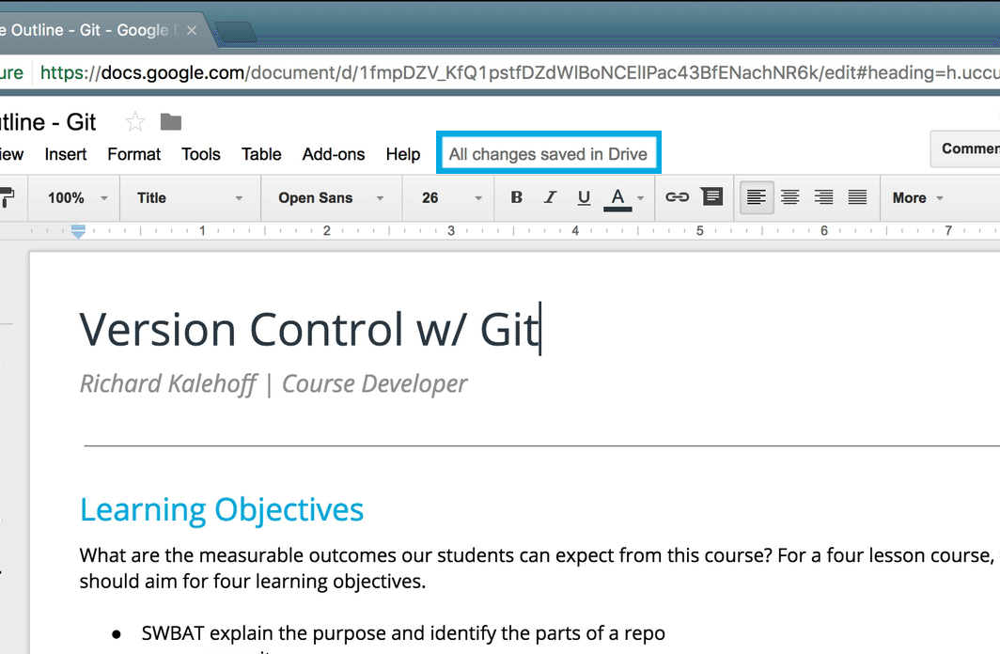

# Version Control In Daily Use

## Version Control Is Everywhere

My job revolves around working with documents. I create new documents all the time, I fill them with information (hopefully informative information!) and then edit...edit...edit! Is your job like this? Perhaps it's not documents of text, but you're probably working with data in some form or another that changes over time.

Now you might not think that you're using version control when working with documents, and you'd be right...sort of. You're not *actively* maintaining different versions of a document as you write it. But that doesn't mean there aren't different versions of the document. The computer is keeping track of the different versions for you!

Don't believe me? Aside from pondering your propensity towards doubting, let's prove I'm right:

- open up your favorite text editor/code editor
- type some content (how about "version control is dull!")
- change one of the words in you wrote (e.g. change "dull" to "life-changing awesome")
- now (here it comes…!) press `cmd` + `z` or `ctrl` + `z`

💥 Version control in action! (See?...told you I wasn't lying) I bet you use the "undo" command all the time. I know that I sure do!

Practically every application I've ever used has an undo feature. You can think of this as a form of version control, but it's a rather limited form of version control. Let's look at a more powerful form by checking out a Google Docs document.

*The Google Doc outline for this Git Course.*

If you've ever written in a Google doc, have you noticed the small gray text at the top that tells you about the status of the document? Ever noticed that as you type, it's actively saving the document? Then, when you finish typing, it tells you that the document has saved.

*Status of a Google Docs document. The status says "Saving…" while the document is being edited, and changes to "All changes saved in Drive" after the content is saved.*

The real question is, did you know that is a link that you can click on? Wanna see for yourself? Try it out in one of your own Google Docs.

Clicking on the link takes you to a "Revision history" page. (Ooo! Did you notice the word "revision"? The word "version" is a synonym for "revision"!)

[video](https://youtu.be/GcvvbdKEchk)

## Revision History Isn't Powerful Enough

Google Docs' Revision history page is incredibly powerful! I've used it on several occasions to salvage text that I'd written at one point, erased, and then realized I actually *did* want to keep.

But for all its ability, it's not as powerful as we'd like. What's it missing? A few that I can think of are:

- the ability to label a change
- the ability to give a detailed explanation of why a change was made
- the ability to move between different versions of the same document
- the ability to undo change A, make edit B, then get back change A without affecting edit B

The version control tool, Git, can do all of those things - *and more!!!* (bet you didn't see *that* coming!) So have I sold you yet on the awesomeness that is Git? I hope so, cause we're about to dive into it in the next section.